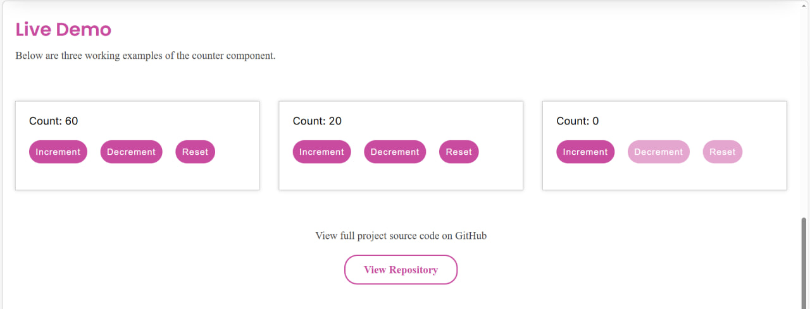

# Kirs_M_HW2

## How It Looks

### Overview
This project is a reusable UI component built using JavaScript OOP principles. The goal is to create a modular `Counter` class that manages internal state and updates the DOM dynamically based on user interaction.

### Current Progress (Week 8)
For this first stage, I have set up the basic repository structure and the initial class build based on what we have covored in the class.
**JS Modules** Established a modular file structure for scalability.
**Base Class** Created the `Counter` skeleton with basic increment functionality.

Also for the initial Week 8 submission, I have established the repository structure in order to maintain a clean workflow and follow the project requirements, I am using a multi-branch strategy:

**readme.md** Used for documentation updates and project tracking.
**des.mk.counter** Dedicated to the UI/UX design, including CSS styling and future GSAP enhancements.
**dev.mk.counter** Used for the core JavaScript OOP logic and functional component development.

### Updated Branch Workflow

**des.mk.design-improvements** – visual refinements and spacing improvements, SASS styling.

**dev.mk.header-menu** – development of responsive navigation menu functionality

**des.mk.footer** – footer layout styling and content adjustments

**dev.mk.animations** – GSAP scroll animations and smooth scrolling behavior

### Progress Update (Week 9)

During this stage I focused on completing the main functionality of the counter component and improving the UI behavior.

I added Decrement and Reset buttons and implemented logic to make sure the counter value cannot go below zero. I also introduced a simple state-driven UI update by visually disabling the Decrement and Reset controls when the count is equal to zero.

To demonstrate inheritance and more advanced OOP concepts, I created a `StepCounter` class that extends the base `Counter` class. This version accepts a custom step value and overrides the increment and decrement methods.

Finally, I started building the documentation layout for the page, including an Overview section, a short How To Use explanation, and a Live Demo area that showcases multiple counter instances with different behaviors.

### Progress Update (Week 10)

During this stage I focused on polishing the overall layout and improving the interaction experience of the component demo page.

I added a responsive header navigation with a mobile menu and implemented smooth scrolling between page sections. I also introduced GreenSock scroll animations to improve the visual presentation of the documentation blocks, feature sections and live demo area.

In addition, I refined the styling of the counter component and documentation layout to make the design more consistent and readable across different screen sizes. A GitHub repository link section was also added below the live demo to provide direct access to the project source code.

To maintain a structured workflow, I continued using a multi-branch development approach and created additional branches for animation implementation, design improvements, footer updates and header functionality.

---

## Features  
- Reusable Counter UI component built with JavaScript OOP  
- State-driven interface updates based on user interaction  
- Increment, Decrement and Reset controls with value protection  
- Subclass implementation using `StepCounter` for custom step logic  
- Multiple independent counter instances rendered on the same page  
- Smooth scrolling navigation between documentation sections  
- Scroll-triggered animations using GreenSock  
- Responsive layout with modular CSS structure  

---

## Tech Stack  
- **Language:** JavaScript (ES Modules)  
- **Concepts Used:** Classes, Inheritance, UI updates based on internal values, Dynamic page element updates  
- **Libraries:** GSAP (ScrollTrigger)  
- **Styling:** CSS / SASS workflow  
- **Version Control:** Git & GitHub  

---

## Structure  
The project is organized into modular JavaScript files:

- **Counter Class** – base reusable component logic  
- **StepCounter Class** – subclass extending counter behavior  
- **HeaderMenu Module** – responsive navigation functionality  
- **SmoothScroll Module** – section navigation interaction  
- **Animations Module** – GSAP scroll animations  

Additional layout components include:  
- Documentation section with overview and usage explanation  
- Live demo area displaying multiple counter instances  
- GitHub link section for project reference  

---

## Purpose  
This assignment was created to:

- Demonstrate understanding of JavaScript Object Oriented Programming  
- Apply inheritance and modular architecture concepts in a UI component  
- Practice building reusable interactive elements  
- Improve workflow organization using branching strategies  

---

## Workflow Notes  
During this project I focused on improving commit structure and separating development tasks into dedicated branches. This helped maintain clarity between functionality updates, styling improvements and animation implementation.

---

## Future Improvements  
- Add additional counter variations or configuration options  
- Improve accessibility and keyboard interaction  
- Expand animation timing control and transitions  
- Enhance visual styling and layout responsiveness  

---

## Installation  
No installation is required.

---

## Usage  
Open the project in a browser or local server environment to view the documentation page and interact with the counter components.

---

## History  
Repository setup  
Base counter logic  
Subclass implementation  
UI documentation layout  
Responsive navigation  
Animation integration  
README updates  

---

## Credits  
Mikhail Kirs  

## License 

MIT License 

**Contact:** 
- [topkun6666@gmail.com](mailto:topkun6666@gmail.com) 
- [phonenumber] +1 (226) 224-6074 
- [GitHub Profile](https://github.com/Mikki667)
- [MyPortfolio] (https://michaelkirsweb.ca/)
